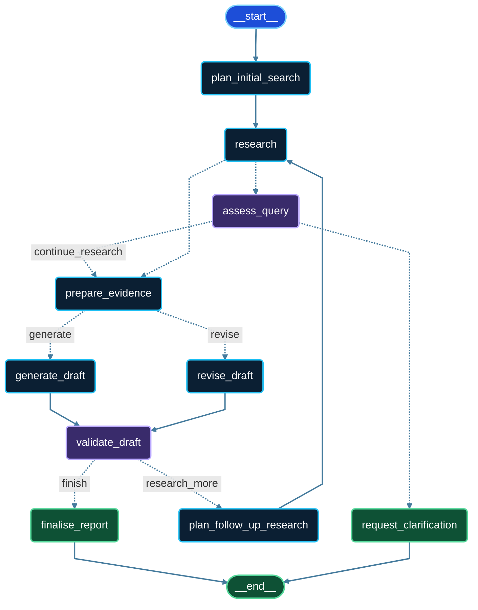

# DRAGNET LangGraph Workflow

This diagram is generated from the compiled DRAGNET LangGraph workflow.

```mermaid

---
config:
  flowchart:
    curve: linear
---
graph TD;
	__start__([<p>__start__</p>]):::first
	plan_initial_search(plan_initial_search)
	research(research)
	assess_query(assess_query)
	request_clarification(request_clarification)
	prepare_evidence(prepare_evidence)
	generate_draft(generate_draft)
	validate_draft(validate_draft)
	plan_follow_up_research(plan_follow_up_research)
	revise_draft(revise_draft)
	finalise_report(finalise_report)
	__end__([<p>__end__</p>]):::last
	__start__ --> plan_initial_search;
	assess_query -. &nbsp;continue_research&nbsp; .-> prepare_evidence;
	assess_query -.-> request_clarification;
	generate_draft --> validate_draft;
	plan_follow_up_research --> research;
	plan_initial_search --> research;
	prepare_evidence -. &nbsp;generate&nbsp; .-> generate_draft;
	prepare_evidence -. &nbsp;revise&nbsp; .-> revise_draft;
	research -.-> assess_query;
	research -.-> prepare_evidence;
	revise_draft --> validate_draft;
	validate_draft -. &nbsp;finish&nbsp; .-> finalise_report;
	validate_draft -. &nbsp;research_more&nbsp; .-> plan_follow_up_research;
	finalise_report --> __end__;
	request_clarification --> __end__;
	classDef default fill:#f2f0ff,line-height:1.2
	classDef first fill-opacity:0
	classDef last fill:#bfb6fc
    classDef process fill:#0B1F33,stroke:#25C2F5,color:#FFFFFF,stroke-width:2px;
classDef decision fill:#392B6B,stroke:#B9A7FF,color:#FFFFFF,stroke-width:2px;
classDef output fill:#0E5135,stroke:#54D89A,color:#FFFFFF,stroke-width:2px;

class plan_initial_search,research,prepare_evidence,generate_draft,revise_draft,plan_follow_up_research process;
class assess_query,validate_draft decision;
class finalise_report,request_clarification output;

linkStyle default stroke:#457B9D,stroke-width:2px;
classDef endNode fill:#0E5135,stroke:#54D89A,color:#FFFFFF,stroke-width:2px;
class __end__ endNode;
classDef startNode fill:#1D4ED8,fill-opacity:1,stroke:#7DD3FC,color:#FFFFFF,stroke-width:2px;
class __start__ startNode;

```